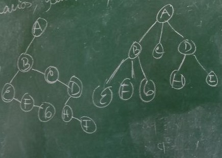
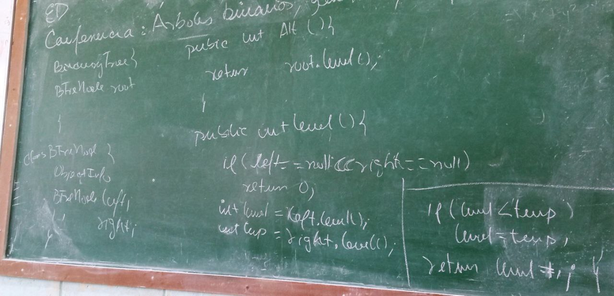

# ED 7 10 2022

## Conf 6: Arboles binarios, generales,busqueda

### Sumario:

    Definicion
    Arboles binarios y generales
    Implementacion

---

```java
//general implementation of a tree
class Tree<T> {
    private TreeNode<T> root;
}

class TreeNode<T> {
    private T info;
    private List<TreeNode<T>> children;
    //for binary trees is common to have
    // instead of a list, 2 Node attributes: right and left
}

class BinaryTreeNode<T> {
    private T info;
    private BinaryTreeNode<T> left;
    private BinaryTreeNode<T> right;
}
```

#### Transformation of a general tree to binary tree



> Grado de un nodo en un arbol (que son dirigidos por definicion) es la cantidad hijos

> Predecesor es el que lo sucede en un recorrido especial  
> En la imagen si recoremos el arbol general a lo ancho, el predecesor de E es D

### Tree height



# Tarea

De esos arboles hacer todos los recoridos

- preorden
- entreorden
- posorden
- a lo ancho
- profundidad

<strong> Traer implementado el insertar nodo </strong>
